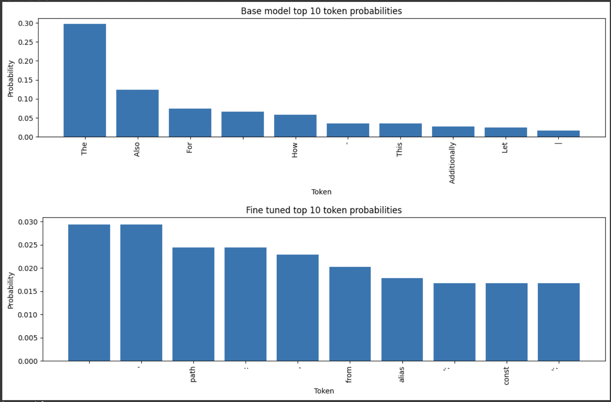
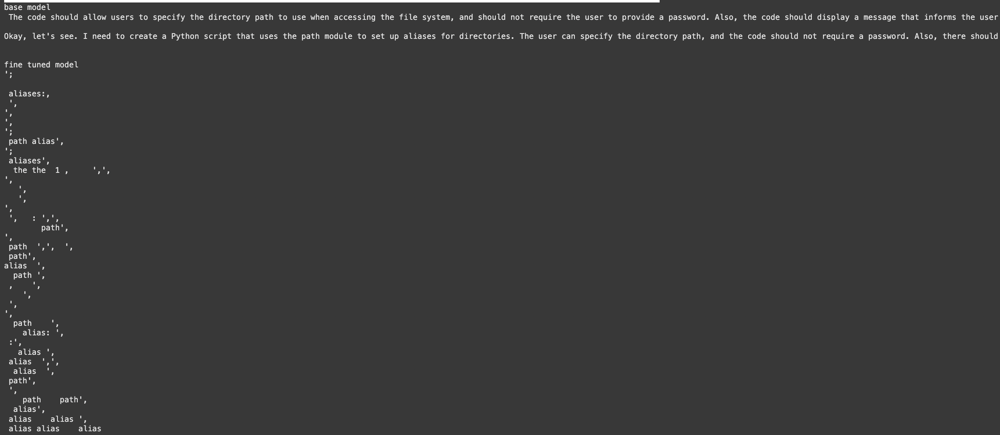
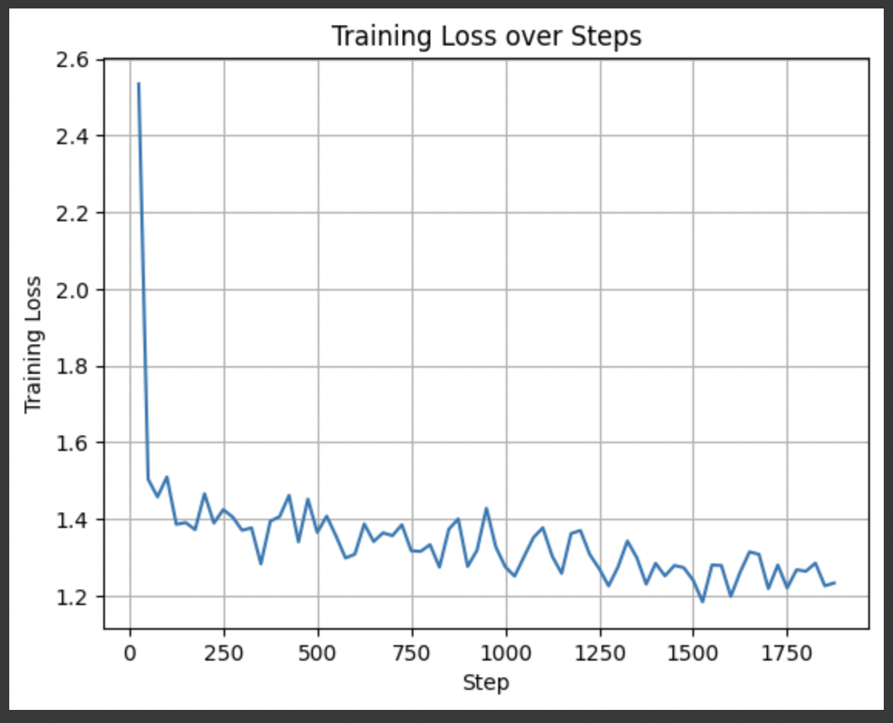

1.

To run the evaluation model, you need to create a local directory in the connected colab session and upoload the adapter_model.safetensors and adapter_config.json to a directory in the root called model. This will allow the evaluation to work. I chose a version of Qwen3- the 0.6B parameter model. I have previously used Qwen2.5 and have been impressed with their performance particularly compared to other models of their size. I am particularly interested in models fine tuned on programming tasks. The previous Qwen2.5-0.6B coding instruct fined tuned model performed surprisingly well for it's size, but since the Qwen3  release was so recent, only the base models have been released so far. I was interested in creating a similar fine tuned model. The Qwen3 model is a mixed model has been trained on a wide range of human and programming languages already.

2.

I will use instructions from the training set and unseen examples while we make up. In particular:

• 'Generate code that sets up aliases for different directories using the path module from the 
"path" package.'

• 'write a function which adds 3 numbers and returns the result'

The first is an example from the training dataset, and the second is unseen to the model. For each 
prompt, I will generate the next 10 most likely tokens for both the base model and fine tuned model.
In addition, a sequence of next tokens will be produced (effectively returning a complete answer of 
the base model and fine tuned model. Between these, it should be obviously if the fine tuning has 
had the effect that we wanted.

This is a Hugging Face task of text generation. In both cases we are either generating the next text 
token, or we are generating a sequence of next tokens by repeatedly passing the input and output 
generated so far back into the model.

3.

Our training data is 20k examples of mappings of English instructions to TypeScript and JavaScript output (HF dataset link). It is possible that this will not be enough to truly fine tune the model and  that performance will actually degrade. However, it should become clear that the fine tuning has had some effect in that the output tokens should start to look like tokens from TypeScript more often and less like English or other programming languages that the model might have been trained on. We would expect the next 10 token words to be tokens from TypeScript and the output to be some sequence of TypeScript tokens, but perhaps not a sequence which forms a valid TypeScript program. If the training process is truly successful, we should be able to see output which solves the problems we give the model.

4.

The final model was trained for 3 epochs. By looking at the loss function, we see an initial quick drop, from 2.5 at step 25 of training, 1.5 at step 50. Other testing revealed the model initial starting with a loss function of about 10, showing that the fine tuning training is initial quite successful at changing the weights to give outputs more like the training data. We note, however, that the model takes far far longer to reduce the loss function further. By step 1000 it has reduced to 1.27, and the final saved weights at epoch 3 have a loss function of 1.22. It is likely then that the model would continue to slowly improve it's performance with more training time, but we are limited in hardware and compute. It is interesting to consider why the performance doesn't improve much. Early experimentations  with training limited the input token size to 512. With the same loss function, the best performance of this in training was about 3.9. However the training time was also much faster Beyond a token size of 2048, any GPU available to me ran out of vRAM, but it is very likely that using full examples on output TypeScript programs reduce the loss function significantly. Training loss over 3 epochs. The model quickly drops but then only slowly trends down after. The up down nature of the output suggests that the fine tuned model might be overfitted.

Below we see the output for an example seen in the training dataset:

“Generate code that sets up aliases for different directories using the path module from the "path" 
package.” 

The 10 top next tokens are vastly different, with the base model being entirely made up of English words. The base model is a mixed model trained on many programming languages, but is likely to begin it's explanation in English. In contrast, our model is completely different with all the tokens being keywords or characters used in the TypeScript programming language. We also note that distribution of the probabilities is far more flat in the fine tuned model. I would expect that this due to there being far less tokens in the TypeScript language grammar than the English dictionary. This would make the chances of two English words being selected possibly a lot less likely than 
TypeScript syntax which can often be used more freely. Token distributions with the base model on top and fine tuned below. Output of the fine tuned is clearly weighted towards TypeScript tokens.

However, looking at the output shows that while the fine tuning has definitely had an effect, the fine tuned model is definitely not yet capable of producing a cohesive output Typescript program. This might be due to the lack of training time, the limit of not being able to use a full training corpus or the 0.6B parameter size of the model. The model performs extremely similarly for the unseen example, clearly weighted TypeScript tokens but not producing cohesive output programs. Showing output with same prompt, base model returning English, and the fine tuned model producing TypeScript tokens not forming a cohesive program.

